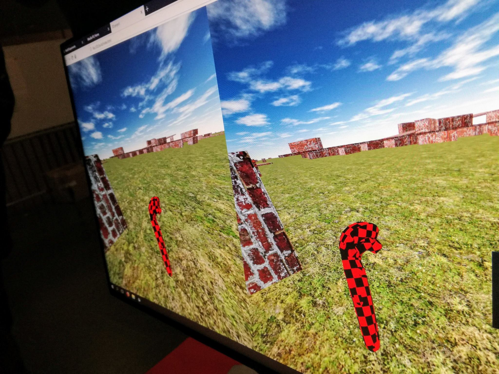

# Virtuální realita na webu
## [Pavol Hejný](https://www.pavolhejny.com/)


https://www.pavolhejny.com/virtualni-realita-na-webu


<footer>2018-09-27 | JobsDev.cz Meetup #4 </footer>


???
Ahoj jmenuji se Pavel Hejný jsem vývojář webových aplikací. Vyvíjím elektronické učebnice matematiky. Miluji nové technologie a proto se účastním konferencí meetupů konferencí a hackathonů.

Před dvěma týdny jsem byl na hackathonu veřejné správy. Myslel jsem, že budu pracovat čistě s daty, ale kromě velkého množství skvělých datových sad jsme měli k dispozici HTC Vive a Oculus Rift. 

Vedle mě stál kamarád se kterým jsme členem české Mozilla komunity a rychle nás napal nápad.
Co kdybychom všechna ta data zobrazovali na mapě v

---

IMG hackathon

???


 kde rád vyvíjím a povídám o nejnovějších možnostech webu. Také jsem člen české Mozilla komunity se kterou chodíme po technologických konferencích a ukazujeme, co všechno dnes na webu jde včetně VR na webu a proto bych vám tom dnes rád řekl.

Než přejdu k virtuální realitě, začnu s 3D technologiemi na webu. Když jsem byl na prvním 1. Jobs Dev konferenci, mluvil jsem na téma na 3D na webu. 

Kde se dá 3D na webu dneska využívá
Napadá mě hned několik příkladů:


---

IMG night sky


---
# Mapy


???
Docela běžně se na webu setkáváme s 3D v mapách.

---
# Sférické 36O° foto/video


???
Sférické fotografie na Facebooku a YouTube.

---
# First person Scéna a Hry


???
Věc která na webu zatím není úplně běžná jsou First person scény na webu


možná rozvést a collapse game


---

# Technologie

## APIs

- WebGL
- ES6, HTML5
- Browser APIs (Pointer Lock API, Fullscreen API...)


???
Jaké technologie to umožní?

Jako hlavní je přístup ke grafické kartě přímo z prohlížeče pomocí WebGL. WebGL bylo standardizované v roce 2011 a dnes je  dostupné v 92% používaných prohlížečů.

WebGL ale rozhodně není jediná technologie díky které se dají 3D scény na webu vytvářet

Velmi důležitým skokem je celkové zlepšení javascriptu - ES6 a HTML5.

Existuje mnoho APIs, která umožňují webovým aplikacím funkce, které byli donedávna možné pouze desktopovým a mobilním aplikacím. Např. Pointer Lock API.

---

# Technologie

## Knihovny

existuje jich velké množství

- Three.js
- Babylon.js (TS)

???

Pokud chce člověk s 3D na webu pracovat bez psaní shaderů a nutnosti ovládat nízkoúrovňové API, je dobré využít některou z knihoven. Existuje jich velké množství. Já jsem vybral dvě které jsou podle mě nejdůležitější a nejzajímavější:

1) Tou první je Three.js. Je velmi dobrá na statické scény a pro ty co píši v čistém javascriptu. Zajímavé na ní je to, že byla vytvořena ještě předtím než bylo WebGL standartem.

2) Má oblíbená je však Babylon.js . Babylon je napsaný v TypeScriptu a je perfektní na vytváření herních a pohyblivých scén na webu.

Obě se následně dají použít i pro virtuální realitu na webu. 

---

# A-Frame

```html
<!DOCTYPE html>
<html>
  <head>
    <meta charset="utf-8">
    <title>Hello, WebVR! • A-Frame</title>
    <meta name="description" content="Hello, WebVR! • A-Frame">
    <script src="https://aframe.io/releases/0.8.2/aframe.min.js"></script>
  </head>
  <body>
    <a-scene background="color: #ECECEC">
      <a-box position="-1 0.5 -3" rotation="0 45 0" color="#4CC3D9" shadow></a-box>
      <a-sphere position="0 1.25 -5" radius="1.25" color="#EF2D5E" shadow></a-sphere>
      <a-cylinder position="1 0.75 -3" radius="0.5" height="1.5" color="#FFC65D" shadow></a-cylinder>
      <a-plane position="0 0 -4" rotation="-90 0 0" width="4" height="4" color="#7BC8A4" shadow></a-plane>
    </a-scene>
  </body>
</html>
```

???

Navíc existuje knihovna A-frame vyvíjená Mozillou postavená nad Three.js, která je designovaná přímo pro virtuální realitu a lze v ní psát scény velmi jednoduše v xml podobně, jak se zapisuje svg v rámci html.

Pokud chcete vytvořit něco velmi jednoduchého a chcete jen kódovat bez nutnosti programovat, použijte práve ji.

---

# A-Frame


---

# Virtuální realita


???


Běžné 3D scény se ovládají pomocí tří věcí kurzoru, dotyku a klávesnicí. A obvykle buď zobrazují předmět, který před sebou otáčíme nebo scénu ve které jsme my postavou a pohybujeme se v ní. Případně zjednodušený případ kdy se pouze otáčíme kolem sférické fotografie či videa.


Virtuální realita se liší pomocí dvou věcí:
Pomocí toho, jak se ovládá a toho, že se renderuje místo do jedné plochy do obou očí.


Brýle virtuální reality například HTC Vive nebo Oculus Rift nejsou vlastně ničím jiným než obyčejnou obrazovkou, která je rozdělena na dvě části - dvě oči. A zároveň dokonale odděluje obraz od okolí. Další věcí kterou dělají je velmi přesné snímání pohybu a orientace natočení.

---

# [WebVR API](https://webvr.info/)

IMG for split screen

???
Pro přenesení obrazu do helmy se používá WebVR API.

---

# Ovládání
- Gamepad API
- DeviceOrientation API

Nice to have bottom right images


???
Druhá velmi důležitá věc pro virtuální realitu velmi přesně synchronizovaný pohyb s obrazem. Jak pohyb helmy, tak pohyb ovladačů v ruce.

V helmách se k přenesení pohybu a natočení používá Gamepad API. Pokud nepoužíváte HTC vive nebo Oculus Rift ale mobil např. s Cardboard, k zaznamenání přesného pohybu využíváte gyroskop v mobilu. Ten se dá z javascriptu snímat pomocí DeviceOrientation API.


---

<!--codesample-->


<iframe class="left" src="https://jsfiddle.net/bm5u7rhg/77/embedded/js,html,css,result/dark/"></iframe>
<iframe class="right hide-topbar" src="https://jsfiddle.net/bm5u7rhg/77/embedded/result/dark/"></iframe>


---


Kam dál, dává VR smysl


---

# Fyzika



---

<blockquote class="twitter-tweet" data-lang="cs"><p lang="cs" dir="ltr">Přijďte na můj workshop &quot;Vytvořte si vlastní webovou hru&quot; a naprogramujte si vlastní způsob jak zdemolovat budovu. ve 14:00 v E105<a href="https://twitter.com/hashtag/openalt?src=hash&amp;ref_src=twsrc%5Etfw">#openalt</a> <a href="https://t.co/NipViK7I2p">pic.twitter.com/NipViK7I2p</a></p>&mdash; Pavol Hejný (@pavolhejny) <a href="https://twitter.com/pavolhejny/status/926779485093027840?ref_src=twsrc%5Etfw">4. listopadu 2017</a></blockquote>
<script async src="https://platform.twitter.com/widgets.js" charset="utf-8"></script>


???
Existuje několik fyzikálních enginů na webu například Cannon.js nebo Oimo.js, které mají přímé napojení na Three.js a Babylon.js. Hodí se hlavně pro vytváření her a ve virtuální realitě a fyzika ve virtuální realitě vypadá velmi dobře.

---

# Zvuk

???
Asi vynechám

---

# Podpora prohlížečů

???
Asi vynechám

---

# Ukázka


- https://webappgames.github.io/3d-project/

- https://webappgames.github.io/collapse-game/

???
Todo


---

# Budoucnost

IMG?

???
Jaká je budoucnost virtuální reality na webu


---

# Moje projekty


???
Todo


